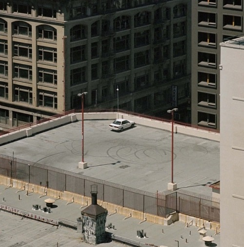
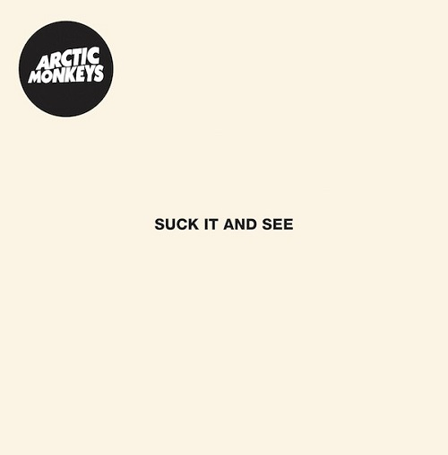
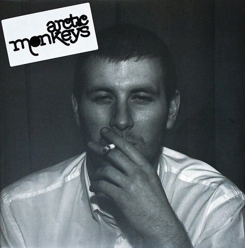
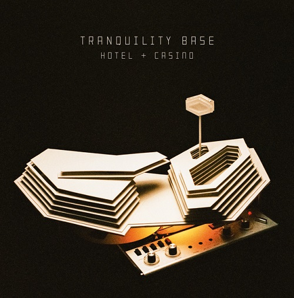
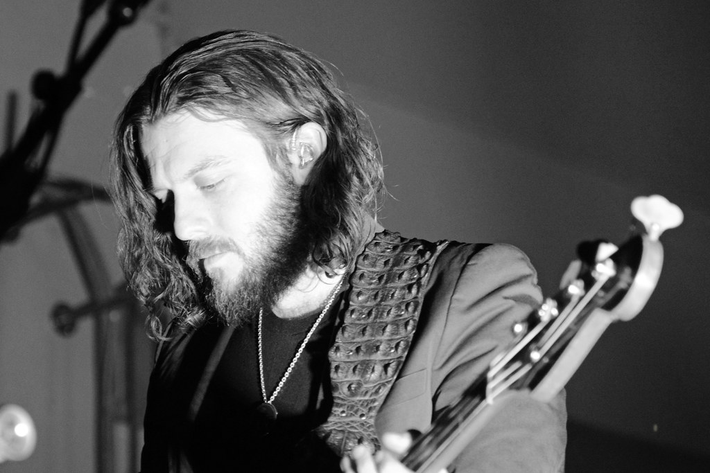
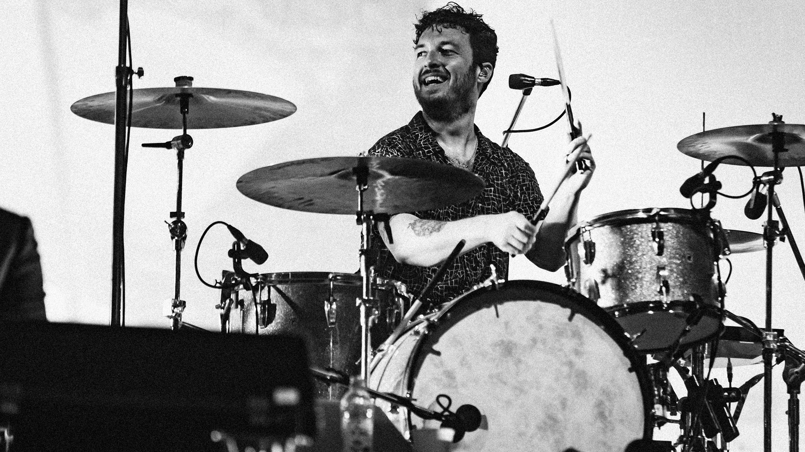
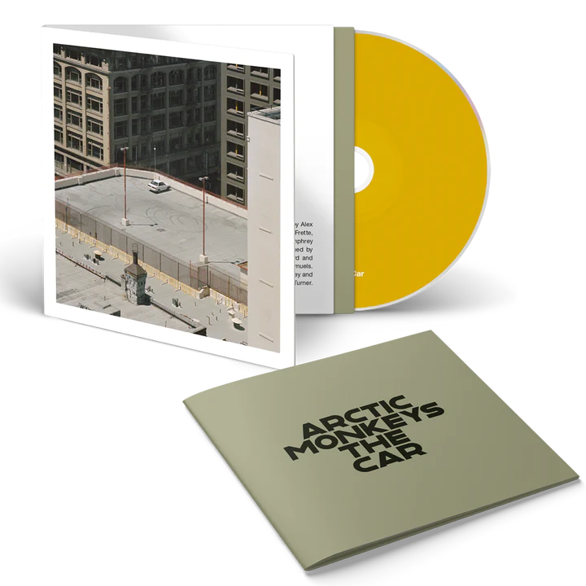

<h1>Memoria del proyecto de evaluación de Lenguaje de Marcas - 1º DAW</h1>
<h2>Arctic Monkeys - A tribute site</h2>

<h2>Índice</h2>
  <ul>
    <li><a href="#introduccion">Introducción</a></li>
    <li><a href="#motivacion">Motivación</a></li>
    <li><a href="#estructura">Estructura</a></li>
    <li><a href="#estilo">Estilo</a></li>
    <li><a href="#code-snippets">Code Snippets</a></li>
  </ul>
      
<h2 id="introduccion">Introducción</h2>

Trabajo realizado por: Sergio Gámez Ortega
  

Proyecto de web "with Bootstrap" de 2º evaluación de Lenguaje de Marcas
  

Enero de 2024
  

<h2 id="motivacion">Motivación</h2>

El tema lo he elegido porque me parecía buena idea hacer una página sobre este banda de música de rock indie ya que su música es muy buena y un buen grupo, también porque es la banda favorita de un familiar.

<h2 id="estructura">Estructura</h2>

La página web esta dividida en 6 secciones:

<ul>
  <li>Hero Section</li>
  <li>Discografía</li>
  <li>Música</li>
  <li>Miembros</li>
  <li>Merchandising</li>
  <li>Footer</li>
</ul>

<h3>Hero Section</h3>

He tomado una imagen de fondo donde se ve al cantante principal de Arctic Monkeys en primer plano pudiendose ver perfectamente incluso para dispositivos móviles. Sobre ella he puesto en grande como título "ARCTIC MONKEYS" y un blockquote del título de una de sus canciones "I Bet You Look Good on the Dancefloor"

<h3>Discografía</h3>

He tomado una imagen de cada uno de los discos/albums de Arctic Monkeys y las he metido en unas cards para imágenes de Bootstrap.

<h3>Música</h3>

He colocado 3 vídeos de YouTube utilizando un grid de 3 columnas.

<h3>Miembros</h3>

He colocado de manera independiente a cada miembro de Arctic Monkeys separados utilizando un grid de 2 columnas separando su respectiva imagen con su texto.

<h3>Merchadising</h3>

En esta sección he colocado una serie de productos de compra oficiales de Arctic Monkeys colocados utilizando un grid de 3 columnas.

<h3>Footer</h3>

En el footer de la página he utilizado otro grid de 3 columnas colocando una repetición de la barra de navegación junto a otro enlace a la página oficial de Arctic Monkeys y sus redes sociales. Abajo de este he puesto en un CODE SNIPPET 'Modal' el proposito con el que se ha creado la página y de quienes son las imagenes, música y merchandising utilizados.

<h2 id="estilo">Estilo</h2>
<h3>Paleta de colores</h3>

He utilizado esta paleta de colores intercalando entre colores claros, medio claros y mas oscuros.

<h3>Tipografías</h3>

He utilizado 2 fuentes de tipografía, una para los títulos y otra para el texto.

<ul>
  <li><a href="https://www.1001fonts.com/search.html?search=Engebrechtre+Regular">Engebrechtre Regular</a> (Títulos)</li>
  <li><a href="https://www.1001fonts.com/search.html?search=Techna+Sans+Regular">Techna Sans Regular</a> (Texto)</li>
</ul>
<h3>Imágenes</h3>

Imágen de la Hero Section.

Estas son las imágenes de los albums de Arctic Monkeys que he utilizado en la galería de imágenes.

Imágenes de los respectivos miembros de la banda.

Imágenes utilizadas en la sección de Merchandising.

Imagen utilizada como favicon de la página. El motivo de usar una bola de disco es porque es algo bastante icónico de Arctic Monkeys ya que la usan muchas veces en sus conciertos.

<b>ADVERTENCIA: </b>Cada imagen pertenece a los Arctic Monkeys y a sus respectivos autores.

<h3>Videos</h3>

He utilizado 3 videos sacados de YouTube de 3 canciones en vivo de los Arctic Monkeys.

<ul>
  <li><a href="https://www.youtube.com/watch?v=c-wwK5QVv1Y">I Bet You Look Good on the Dancefloor</a></li>
  <li><a href="https://www.youtube.com/watch?v=IjfotqT2c0o">Fluorescent Adolescent</a></li>
  <li><a href="https://www.youtube.com/watch?v=Azc4tG1lnoQ">Body Paint</a></li>
</ul>

<b>ADVERTENCIA: </b>Cada video pertenece a su respectivos canales/autores.

<h2 id="code-snippets">Code Snippets</h2>

He utilizado los siguientes:

<ul>
  <li>Barra de navegación: tomada de Bootstrap <a href="https://getbootstrap.com/docs/5.3/components/navbar/">"Components"</a></li>
  <li>Galeria de imágenes estilo Carousel: tomada de Bootstrap <a href="https://getbootstrap.com/docs/5.3/components/carousel/">"Components"</a></li>
  <li>Cards: tomada de Bootstrap <a href="https://getbootstrap.com/docs/5.3/components/card/">"Components"</a></li>
  <li>Modal: tomada de Bootstrap <a href="https://getbootstrap.com/docs/5.3/components/modal/">"Components"</a></li>
  <li>Efectos de imagen/card.</li>
</ul>
